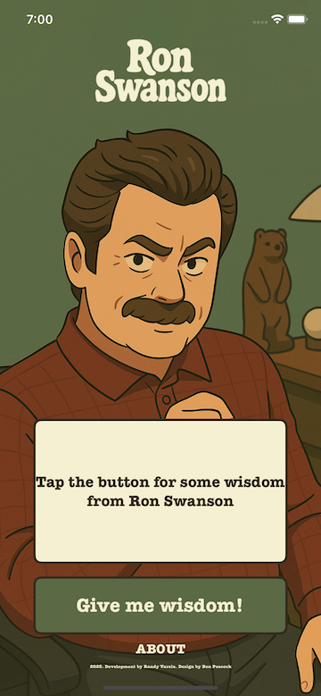

# 📱 Swanson Says
> A single screen app that imparts wisdom from Duke Silver

---

## 🧠 About

Swanson Says is a lightweight iOS app that delivers random quotes from the legendary Ron Swanson at the tap of a button. Built using UIKit, the app features a clean single-screen layout, demonstrating basic user interaction, randomness, and string rendering in Swift. It’s a fun and simple project focused on UI responsiveness and Swift fundamentals.

Leverages a free API that stores quotes

---

## 🖼️ Screenshots




---

## ⚙️ Tech Stack

- Swift
- UIKit
- URLSession / JSON Decoding
- Auto Layout
- API: https://ron-swanson-quotes.herokuapp.com/v2/quotes

---

## 🚀 Getting Started

To run this project locally:

```bash
git clone https://github.com/your-username/your-repo.git
